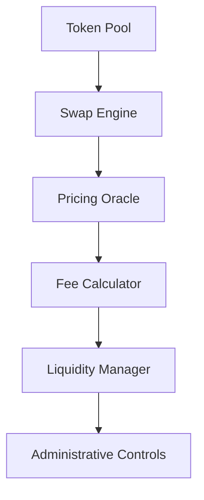

# Token Swap Smart Contract

A sophisticated Clarity smart contract implementing automated market maker (AMM) functionality with dynamic pricing, liquidity provision, and comprehensive administrative controls.

## Table of Contents
- Overview
- Architecture
- Technical Specifications
- Contract Components
- Functions Reference
- Installation
- Usage Guide
- Security Measures
- Testing Framework
- Deployment
- Contributing
- License

## Overview 

The Token Swap Smart Contract enables decentralized exchange of tokens using an automated market maker model. It incorporates advanced features such as:

- Constant product market maker formula
- Dynamic fee adjustment
- Liquidity provider incentives
- Emergency circuit breakers
- Real-time price feeds
- Slippage protection
- Multi-signature administrative controls

## Architecture 

### Core Components



### Data Structure

```clarity
(define-map liquidity-providers principal
    {
        token-a-provided: uint,
        token-b-provided: uint,
        share-percentage: uint
    })
```

## Technical Specifications 

### Constants
| Name | Type | Description | Default |
|------|------|-------------|---------|
| `contract-owner` | principal | Contract administrator | tx-sender |
| `exchange-rate` | uint | Base exchange rate | u100 |
| `fee-percentage` | uint | Trading fee percentage | u3 |

### Error Codes
| Code | Description | Mitigation |
|------|-------------|------------|
| u100 | Owner-only operation | Verify caller is contract owner |
| u101 | Insufficient balance | Ensure adequate funds before operation |
| u102 | Invalid amount | Validate input amounts > 0 |
| u103 | Pool empty | Maintain minimum liquidity threshold |
| u104 | Contract paused | Wait for contract reactivation |
| u105 | Invalid fee percentage | Keep fee within allowed range |
| u106 | Emergency conditions | Meet emergency criteria |

## Contract Components 

### 1. Token Pool Management
- Dual-token liquidity pool
- Automated balance tracking
- Real-time liquidity depth monitoring

### 2. Price Discovery Mechanism
- Constant product formula: x * y = k
- Dynamic price adjustments
- Slippage protection

### 3. Liquidity Provider System
- Share token minting/burning
- Fee distribution
- Provider position tracking

### 4. Administrative Framework
- Multi-signature requirements
- Graduated access levels
- Emergency procedures

## Functions Reference 

### Core Functions

#### swap-a-to-b
```clarity
(define-public (swap-a-to-b (amount uint))
    (begin
        (asserts! (not (var-get paused)) (err u104))
        ;; ... function implementation
    ))
```
Parameters:
- `amount`: uint - Amount of token A to swap

Returns:
- (ok uint) - Amount of token B received
- (err uint) - Error code if swap fails

#### add-liquidity
```clarity
(define-public (add-liquidity (token-a-amount uint) (token-b-amount uint))
    (begin
        ;; ... function implementation
    ))
```

### Query Functions

#### get-balances
Returns current pool balances for both tokens.

#### get-exchange-rate
Returns current exchange rate between tokens.

### Administrative Functions

#### update-exchange-rate
Allows owner to update base exchange rate.

## Installation 

1. Prerequisites
   - Clarity CLI tools
   - Stacks blockchain node
   - Development environment setup

2. Environment Setup
```bash
# Install dependencies
clarinet install

# Initialize project
clarinet new token-swap
```

## Usage Guide 

### Basic Operations

1. Token Swapping
```clarity
;; Swap 1000 tokens with 1% slippage tolerance
(contract-call? .token-swap swap-a-to-b u1000 {slippage: u1})
```

2. Liquidity Provision
```clarity
;; Add equal amounts of both tokens
(contract-call? .token-swap add-liquidity u5000 u5000)
```

### Advanced Operations

1. Flash Swaps
```clarity
;; Execute atomic swap with callback
(contract-call? .token-swap flash-swap u1000 'ST1PQHQKV0RJXZFY1DGX8MNSNYVE3VGZJSRTPGZGM)
```

2. Range Orders
```clarity
;; Place range order
(contract-call? .token-swap create-range-order {
    lower-tick: i32,
    upper-tick: i32,
    amount: uint
})
```

## Security Measures 

### Access Control
- Role-based access control (RBAC)
- Time-locked operations
- Multi-signature requirements

### Safety Checks
- Reentrancy protection
- Integer overflow prevention
- Balance verification

### Circuit Breakers
- Emergency pause mechanism
- Gradual unpause process
- Automated circuit breakers

## Testing Framework 

### Unit Tests
```clarity
;; Test basic swap functionality
(test-swap-exact-tokens
    (tuple 
        (input u1000)
        (expected-output u950)
        (max-slippage u1)))
```

### Integration Tests
1. Liquidity provision scenarios
2. Complex swap paths
3. Administrative operations
4. Emergency procedures

## Deployment 

### Mainnet Deployment
```bash
clarinet deploy --network mainnet \
    --token-swap token-swap.clar \
    --admin-key <ADMIN_KEY>
```

### Configuration
```toml
[network.mainnet]
auth = "admin-key"
node_url = "https://stacks-node-api.mainnet.stacks.co"
```

## Contributing 

1. Fork repository
2. Create feature branch
3. Submit pull request
4. Pass automated tests
5. Undergo security review

## License 

MIT License

Copyright (c) 2024

Permission is hereby granted, free of charge, to any person obtaining a copy of this software.
